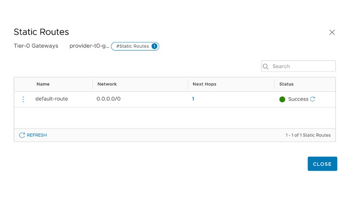
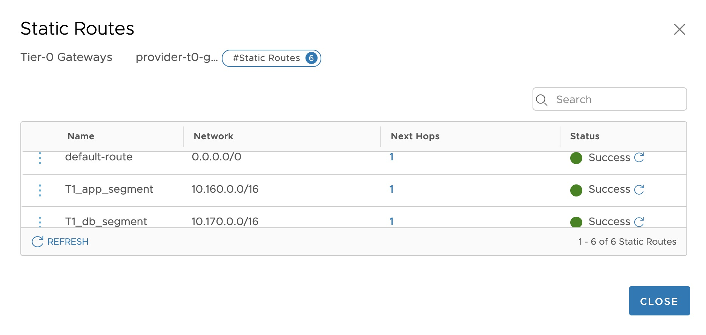

# NSX-T Automation with Terraform

Here are some of the Terraform script used to automate NSX-T.</br>

1. Creation of multiple static routes using `.csv` file 
2. Creation of multiple logical segments using `.csv` file


## 1) Creation of Multiple Static Routes

This Terraform file required the following, 

- Terraform version `0.13` and above 
- Terraform `NSX-T Provider`

It make use the [`csvdecode`](https://www.terraform.io/docs/configuration/functions/csvdecode.html) Terraform function.</br>


### Files
Put the following files in the working directory

- `main.tf`
- `variable.tf`
- `version.tf`
- `terraform.tfvars`
- `static_route.tf`
- `static_route.csv`


#### main.tf 
The `main.tf` file is use to define connection to NSX-T Manager. </br>
```hcl
/* 
  Main file connecting to NSX Manager
*/

# Define Provider 
provider "nsxt" {
  host                  = var.nsx_manager
  username              = var.nsx_username
  password              = var.nsx_password
  allow_unverified_ssl  = true
  max_retries           = 10
  retry_min_delay       = 500
  retry_max_delay       = 5000
  retry_on_status_codes = [429]
}
```
#### version.tf 
The `version.tf` file defined the minimum version of Terraform and provider to use.

```hcl
terraform {
  required_providers {
    nsxt = {
      source = "terraform-providers/nsxt"
    }
  }
  required_version = ">= 0.13"
}
```

#### variable.tf 
The `variable.tf` file defined the variable used.

```hcl
/*
   Variable definition.
   Can be define in single or separate file(s)
   Input Variable will obtain from, 
   1) .tfvars file 
   2) if variable in not found in .tfvars
   3) it will look for local machine environment variable TF_VAR_<variable>="<value>"
   4) lastly it will prompt for value of the variable
*/

variable "nsx_manager" {
  description = "IP or FQDN of NSX Manager"
  type        = string
}

variable "nsx_username" {
  description = "The admin username of NSX Manager"
  type        = string
}

variable "nsx_password" {
  description = "The admin password of NSX Manager"
  type        = string
}
```

#### terraform.tfvars
The `terraform.tfvars` file defined the input variable.

```hcl
# Insert the IP address or hostname of the NSX-T Manager
nsx_manager = "172.16.1.31"

# Insert the usreanme of the NSX-T Manager
nsx_username = "admin"

# Password recommended to use encrypted secret or input prompt
nsx_password = "VMware1!VMware1!"
```

#### static_route.tf
The `static_route.tfvars` file defined the code to automate the creation of static routes.</br>

```hcl
/* 
  Configure multiple static routes using CSV file 
*/

# Define Tier0 Gateway Data Source
data "nsxt_policy_tier0_gateway" "provider-t0-gateway" {
  display_name = "provider-t0-gateway"
}

# Import CSV file "static_route.csv" in local directory
# Using csvdecode function
locals {
csv_data = file("static_route.csv")
instances = csvdecode(local.csv_data)
}


# Define Resource
resource "nsxt_policy_static_route" "staticRoute" {
  for_each = { for inst in local.instances : inst.id => inst }
  display_name = each.value.display_name
  gateway_path = data.nsxt_policy_tier0_gateway.provider-t0-gateway.path
  network      = each.value.network

  next_hop {
    admin_distance = "1"
    ip_address     = each.value.next_hop_ip
  }
}
```

#### static_route.csv
The `static_route.csv` file defined the static routes in Comma-separated format.</br>

```csv
id,display_name,network,next_hop_ip
1,T1_web_segment,10.150.2.0/24,10.10.10.1
2,T1_app_segment,10.160.0.0/16,10.10.10.1
3,T1_db_segment,10.170.0.0/16,10.10.20.1
4,T2_web_segment,10.180.100.0/24,10.10.50.254
5,T3_app_segement,10.202.20.0/24,10.10.50.254
```


### Terraform Command
Before run the Terraform command, below are the screen capture of the NSX-T Screen.</br>




#### terraform init 
Use the `terraform init` command to  initialize a working directory containing Terraform configuration files.

```terraform
./terraform init                                                            ✔ 

Initializing the backend...

Initializing provider plugins...
- Using previously-installed terraform-providers/nsxt v2.1.1

The following providers do not have any version constraints in configuration,
so the latest version was installed.

To prevent automatic upgrades to new major versions that may contain breaking
changes, we recommend adding version constraints in a required_providers block
in your configuration, with the constraint strings suggested below.

* terraform-providers/nsxt: version = "~> 2.1.1"

Terraform has been successfully initialized!

You may now begin working with Terraform. Try running "terraform plan" to see
any changes that are required for your infrastructure. All Terraform commands
should now work.

If you ever set or change modules or backend configuration for Terraform,
rerun this command to reinitialize your working directory. If you forget, other
commands will detect it and remind you to do so if necessary.
```


#### terraform plan 
Use the `terraform plan` command to create an execution plan and to check if the changes matches your expectations without making any actual changes.

```terraform 
./terraform plan  

Refreshing Terraform state in-memory prior to plan...
The refreshed state will be used to calculate this plan, but will not be
persisted to local or remote state storage.

data.nsxt_policy_tier0_gateway.provider-t0-gateway: Refreshing state...

------------------------------------------------------------------------

An execution plan has been generated and is shown below.
Resource actions are indicated with the following symbols:
  + create

Terraform will perform the following actions:

  # nsxt_policy_static_route.staticRoute["1"] will be created
  + resource "nsxt_policy_static_route" "staticRoute" {
      + display_name = "T1_web_segment"
      + gateway_path = "/infra/tier-0s/provider-t0-gateway"
      + id           = (known after apply)
      + network      = "10.150.2.0/24"
      + nsx_id       = (known after apply)
      + path         = (known after apply)
      + revision     = (known after apply)

      + next_hop {
          + admin_distance = 1
          + ip_address     = "10.10.10.1"
        }
    }

  # nsxt_policy_static_route.staticRoute["2"] will be created
  + resource "nsxt_policy_static_route" "staticRoute" {
      + display_name = "T1_app_segment"
      + gateway_path = "/infra/tier-0s/provider-t0-gateway"
      + id           = (known after apply)
      + network      = "10.160.0.0/16"
      + nsx_id       = (known after apply)
      + path         = (known after apply)
      + revision     = (known after apply)

      + next_hop {
          + admin_distance = 1
          + ip_address     = "10.10.10.1"
        }
    }

  # nsxt_policy_static_route.staticRoute["3"] will be created
  + resource "nsxt_policy_static_route" "staticRoute" {
      + display_name = "T1_db_segment"
      + gateway_path = "/infra/tier-0s/provider-t0-gateway"
      + id           = (known after apply)
      + network      = "10.170.0.0/16"
      + nsx_id       = (known after apply)
      + path         = (known after apply)
      + revision     = (known after apply)

      + next_hop {
          + admin_distance = 1
          + ip_address     = "10.10.20.1"
        }
    }

  # nsxt_policy_static_route.staticRoute["4"] will be created
  + resource "nsxt_policy_static_route" "staticRoute" {
      + display_name = "T2_web_segment"
      + gateway_path = "/infra/tier-0s/provider-t0-gateway"
      + id           = (known after apply)
      + network      = "10.180.100.0/24"
      + nsx_id       = (known after apply)
      + path         = (known after apply)
      + revision     = (known after apply)

      + next_hop {
          + admin_distance = 1
          + ip_address     = "10.10.50.254"
        }
    }

  # nsxt_policy_static_route.staticRoute["5"] will be created
  + resource "nsxt_policy_static_route" "staticRoute" {
      + display_name = "T3_app_segement"
      + gateway_path = "/infra/tier-0s/provider-t0-gateway"
      + id           = (known after apply)
      + network      = "10.202.20.0/24"
      + nsx_id       = (known after apply)
      + path         = (known after apply)
      + revision     = (known after apply)

      + next_hop {
          + admin_distance = 1
          + ip_address     = "10.10.50.254"
        }
    }

Plan: 5 to add, 0 to change, 0 to destroy.

------------------------------------------------------------------------

Note: You didn't specify an "-out" parameter to save this plan, so Terraform
can't guarantee that exactly these actions will be performed if
"terraform apply" is subsequently run.
```

#### terraform apply 
Use the `terraform apply` command to apply the changes. 

```terraform
./terraform apply  

data.nsxt_policy_tier0_gateway.provider-t0-gateway: Refreshing state...

An execution plan has been generated and is shown below.
Resource actions are indicated with the following symbols:
  + create

Terraform will perform the following actions:

  # nsxt_policy_static_route.staticRoute["1"] will be created
  + resource "nsxt_policy_static_route" "staticRoute" {
      + display_name = "T1_web_segment"
      + gateway_path = "/infra/tier-0s/provider-t0-gateway"
      + id           = (known after apply)
      + network      = "10.150.2.0/24"
      + nsx_id       = (known after apply)
      + path         = (known after apply)
      + revision     = (known after apply)

      + next_hop {
          + admin_distance = 1
          + ip_address     = "10.10.10.1"
        }
    }

  # nsxt_policy_static_route.staticRoute["2"] will be created
  + resource "nsxt_policy_static_route" "staticRoute" {
      + display_name = "T1_app_segment"
      + gateway_path = "/infra/tier-0s/provider-t0-gateway"
      + id           = (known after apply)
      + network      = "10.160.0.0/16"
      + nsx_id       = (known after apply)
      + path         = (known after apply)
      + revision     = (known after apply)

      + next_hop {
          + admin_distance = 1
          + ip_address     = "10.10.10.1"
        }
    }

  # nsxt_policy_static_route.staticRoute["3"] will be created
  + resource "nsxt_policy_static_route" "staticRoute" {
      + display_name = "T1_db_segment"
      + gateway_path = "/infra/tier-0s/provider-t0-gateway"
      + id           = (known after apply)
      + network      = "10.170.0.0/16"
      + nsx_id       = (known after apply)
      + path         = (known after apply)
      + revision     = (known after apply)

      + next_hop {
          + admin_distance = 1
          + ip_address     = "10.10.20.1"
        }
    }

  # nsxt_policy_static_route.staticRoute["4"] will be created
  + resource "nsxt_policy_static_route" "staticRoute" {
      + display_name = "T2_web_segment"
      + gateway_path = "/infra/tier-0s/provider-t0-gateway"
      + id           = (known after apply)
      + network      = "10.180.100.0/24"
      + nsx_id       = (known after apply)
      + path         = (known after apply)
      + revision     = (known after apply)

      + next_hop {
          + admin_distance = 1
          + ip_address     = "10.10.50.254"
        }
    }

  # nsxt_policy_static_route.staticRoute["5"] will be created
  + resource "nsxt_policy_static_route" "staticRoute" {
      + display_name = "T3_app_segement"
      + gateway_path = "/infra/tier-0s/provider-t0-gateway"
      + id           = (known after apply)
      + network      = "10.202.20.0/24"
      + nsx_id       = (known after apply)
      + path         = (known after apply)
      + revision     = (known after apply)

      + next_hop {
          + admin_distance = 1
          + ip_address     = "10.10.50.254"
        }
    }

Plan: 5 to add, 0 to change, 0 to destroy.

Do you want to perform these actions?
  Terraform will perform the actions described above.
  Only 'yes' will be accepted to approve.

  Enter a value: yes

nsxt_policy_static_route.staticRoute["3"]: Creating...
nsxt_policy_static_route.staticRoute["4"]: Creating...
nsxt_policy_static_route.staticRoute["5"]: Creating...
nsxt_policy_static_route.staticRoute["2"]: Creating...
nsxt_policy_static_route.staticRoute["1"]: Creating...
nsxt_policy_static_route.staticRoute["3"]: Creation complete after 0s [id=27fba098-5db4-49a6-a794-0a74aa8ee441]
nsxt_policy_static_route.staticRoute["4"]: Creation complete after 0s [id=6bcb09ec-188b-4b19-8ac9-cc5352988bbf]
nsxt_policy_static_route.staticRoute["5"]: Creation complete after 1s [id=838536e3-f5ea-43a1-8597-f4fdba76db11]
nsxt_policy_static_route.staticRoute["2"]: Creation complete after 1s [id=0153db95-e555-471f-9e51-5b3d01b57b17]
nsxt_policy_static_route.staticRoute["1"]: Creation complete after 1s [id=75f5171f-7ee7-483e-a308-581413e034a7]

Apply complete! Resources: 5 added, 0 changed, 0 destroyed.
```




#### To Delete Multiple Static Routes 
Use `terraform show` command to inspect the current state as Terraform sees it.

```terraform
./terraform show

# data.nsxt_policy_tier0_gateway.provider-t0-gateway:
data "nsxt_policy_tier0_gateway" "provider-t0-gateway" {
    display_name = "provider-t0-gateway"
    id           = "provider-t0-gateway"
    path         = "/infra/tier-0s/provider-t0-gateway"
}

# nsxt_policy_static_route.staticRoute["1"]:
resource "nsxt_policy_static_route" "staticRoute" {
    display_name = "T1_web_segment"
    gateway_path = "/infra/tier-0s/provider-t0-gateway"
    id           = "75f5171f-7ee7-483e-a308-581413e034a7"
    network      = "10.150.2.0/24"
    nsx_id       = "75f5171f-7ee7-483e-a308-581413e034a7"
    path         = "/infra/tier-0s/provider-t0-gateway/static-routes/75f5171f-7ee7-483e-a308-581413e034a7"
    revision     = 0

    next_hop {
        admin_distance = 1
        ip_address     = "10.10.10.1"
    }
}

# nsxt_policy_static_route.staticRoute["2"]:
resource "nsxt_policy_static_route" "staticRoute" {
    display_name = "T1_app_segment"
    gateway_path = "/infra/tier-0s/provider-t0-gateway"
    id           = "0153db95-e555-471f-9e51-5b3d01b57b17"
    network      = "10.160.0.0/16"
    nsx_id       = "0153db95-e555-471f-9e51-5b3d01b57b17"
    path         = "/infra/tier-0s/provider-t0-gateway/static-routes/0153db95-e555-471f-9e51-5b3d01b57b17"
    revision     = 0

    next_hop {
        admin_distance = 1
        ip_address     = "10.10.10.1"
    }
}

# nsxt_policy_static_route.staticRoute["3"]:
resource "nsxt_policy_static_route" "staticRoute" {
    display_name = "T1_db_segment"
    gateway_path = "/infra/tier-0s/provider-t0-gateway"
    id           = "27fba098-5db4-49a6-a794-0a74aa8ee441"
    network      = "10.170.0.0/16"
    nsx_id       = "27fba098-5db4-49a6-a794-0a74aa8ee441"
    path         = "/infra/tier-0s/provider-t0-gateway/static-routes/27fba098-5db4-49a6-a794-0a74aa8ee441"
    revision     = 0

    next_hop {
        admin_distance = 1
        ip_address     = "10.10.20.1"
    }
}

# nsxt_policy_static_route.staticRoute["4"]:
resource "nsxt_policy_static_route" "staticRoute" {
    display_name = "T2_web_segment"
    gateway_path = "/infra/tier-0s/provider-t0-gateway"
    id           = "6bcb09ec-188b-4b19-8ac9-cc5352988bbf"
    network      = "10.180.100.0/24"
    nsx_id       = "6bcb09ec-188b-4b19-8ac9-cc5352988bbf"
    path         = "/infra/tier-0s/provider-t0-gateway/static-routes/6bcb09ec-188b-4b19-8ac9-cc5352988bbf"
    revision     = 0

    next_hop {
        admin_distance = 1
        ip_address     = "10.10.50.254"
    }
}

# nsxt_policy_static_route.staticRoute["5"]:
resource "nsxt_policy_static_route" "staticRoute" {
    display_name = "T3_app_segement"
    gateway_path = "/infra/tier-0s/provider-t0-gateway"
    id           = "838536e3-f5ea-43a1-8597-f4fdba76db11"
    network      = "10.202.20.0/24"
    nsx_id       = "838536e3-f5ea-43a1-8597-f4fdba76db11"
    path         = "/infra/tier-0s/provider-t0-gateway/static-routes/838536e3-f5ea-43a1-8597-f4fdba76db11"
    revision     = 0

    next_hop {
        admin_distance = 1
        ip_address     = "10.10.50.254"
    }
}
```

#### terraform plan -destroy 
Use `terraform plan -destroy` command to check if the destroy changes matches your expectations without making any actual changes.

```terraform
./terraform plan -destroy                                                       

Refreshing Terraform state in-memory prior to plan...
The refreshed state will be used to calculate this plan, but will not be
persisted to local or remote state storage.

data.nsxt_policy_tier0_gateway.provider-t0-gateway: Refreshing state... [id=provider-t0-gateway]
nsxt_policy_static_route.staticRoute["3"]: Refreshing state... [id=27fba098-5db4-49a6-a794-0a74aa8ee441]
nsxt_policy_static_route.staticRoute["4"]: Refreshing state... [id=6bcb09ec-188b-4b19-8ac9-cc5352988bbf]
nsxt_policy_static_route.staticRoute["5"]: Refreshing state... [id=838536e3-f5ea-43a1-8597-f4fdba76db11]
nsxt_policy_static_route.staticRoute["2"]: Refreshing state... [id=0153db95-e555-471f-9e51-5b3d01b57b17]
nsxt_policy_static_route.staticRoute["1"]: Refreshing state... [id=75f5171f-7ee7-483e-a308-581413e034a7]

------------------------------------------------------------------------

An execution plan has been generated and is shown below.
Resource actions are indicated with the following symbols:
  - destroy

Terraform will perform the following actions:

  # nsxt_policy_static_route.staticRoute["1"] will be destroyed
  - resource "nsxt_policy_static_route" "staticRoute" {
      - display_name = "T1_web_segment" -> null
      - gateway_path = "/infra/tier-0s/provider-t0-gateway" -> null
      - id           = "75f5171f-7ee7-483e-a308-581413e034a7" -> null
      - network      = "10.150.2.0/24" -> null
      - nsx_id       = "75f5171f-7ee7-483e-a308-581413e034a7" -> null
      - path         = "/infra/tier-0s/provider-t0-gateway/static-routes/75f5171f-7ee7-483e-a308-581413e034a7" -> null
      - revision     = 0 -> null

      - next_hop {
          - admin_distance = 1 -> null
          - ip_address     = "10.10.10.1" -> null
        }
    }

 [ ----- output omitted --------] 

Plan: 0 to add, 0 to change, 5 to destroy.
```


#### terraform destroy 
Use `terraform destroy` command to destroy the Terraform-managed infrastructure. 

```terraform
./terraform destroy                                                             
data.nsxt_policy_tier0_gateway.provider-t0-gateway: Refreshing state... [id=provider-t0-gateway]
nsxt_policy_static_route.staticRoute["1"]: Refreshing state... [id=75f5171f-7ee7-483e-a308-581413e034a7]
nsxt_policy_static_route.staticRoute["2"]: Refreshing state... [id=0153db95-e555-471f-9e51-5b3d01b57b17]
nsxt_policy_static_route.staticRoute["3"]: Refreshing state... [id=27fba098-5db4-49a6-a794-0a74aa8ee441]
nsxt_policy_static_route.staticRoute["5"]: Refreshing state... [id=838536e3-f5ea-43a1-8597-f4fdba76db11]
nsxt_policy_static_route.staticRoute["4"]: Refreshing state... [id=6bcb09ec-188b-4b19-8ac9-cc5352988bbf]

An execution plan has been generated and is shown below.
Resource actions are indicated with the following symbols:
  - destroy

Terraform will perform the following actions:

  # nsxt_policy_static_route.staticRoute["1"] will be destroyed
  - resource "nsxt_policy_static_route" "staticRoute" {
      - display_name = "T1_web_segment" -> null
      - gateway_path = "/infra/tier-0s/provider-t0-gateway" -> null
      - id           = "75f5171f-7ee7-483e-a308-581413e034a7" -> null
      - network      = "10.150.2.0/24" -> null
      - nsx_id       = "75f5171f-7ee7-483e-a308-581413e034a7" -> null
      - path         = "/infra/tier-0s/provider-t0-gateway/static-routes/75f5171f-7ee7-483e-a308-581413e034a7" -> null
      - revision     = 0 -> null

      - next_hop {
          - admin_distance = 1 -> null
          - ip_address     = "10.10.10.1" -> null
        }
    }

 [ ----- output omitted ------- ]

Plan: 0 to add, 0 to change, 5 to destroy.

Do you really want to destroy all resources?
  Terraform will destroy all your managed infrastructure, as shown above.
  There is no undo. Only 'yes' will be accepted to confirm.

  Enter a value: yes

nsxt_policy_static_route.staticRoute["3"]: Destroying... [id=27fba098-5db4-49a6-a794-0a74aa8ee441]
nsxt_policy_static_route.staticRoute["4"]: Destroying... [id=6bcb09ec-188b-4b19-8ac9-cc5352988bbf]
nsxt_policy_static_route.staticRoute["2"]: Destroying... [id=0153db95-e555-471f-9e51-5b3d01b57b17]
nsxt_policy_static_route.staticRoute["5"]: Destroying... [id=838536e3-f5ea-43a1-8597-f4fdba76db11]
nsxt_policy_static_route.staticRoute["1"]: Destroying... [id=75f5171f-7ee7-483e-a308-581413e034a7]
nsxt_policy_static_route.staticRoute["3"]: Destruction complete after 1s
nsxt_policy_static_route.staticRoute["4"]: Destruction complete after 1s
nsxt_policy_static_route.staticRoute["2"]: Destruction complete after 1s
nsxt_policy_static_route.staticRoute["5"]: Destruction complete after 1s
nsxt_policy_static_route.staticRoute["1"]: Destruction complete after 1s

Destroy complete! Resources: 5 destroyed.
```


